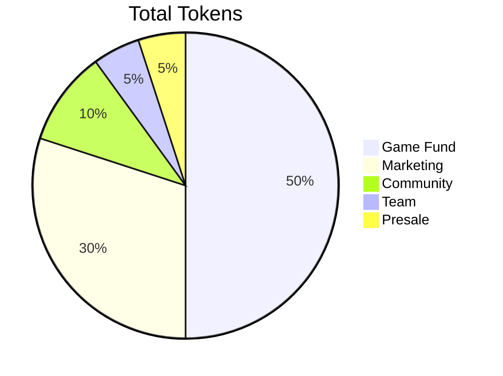

# MazeTon 🌀 A Telegram Mini App AI-Generated Mazes Adventure

<div style="text-align:center" align="center">
    
</div>

Welcome to **MazeTon**, an immersive 3D AI-generated maze game designed as a Telegram Mini App! Navigate through challenging mazes, collect hidden treasures and challenge your friends - all in the familiar Telegram interface.

## 🌌 Dive into the Maze

Embark on a journey through a world of vibrant mazes that evolve as you progress. Each maze is a unique blend of colors and challenges, offering a fresh experience every time you play.

- **Explore Dynamic Environments**: Wander through mazes that change in size and complexity, adorned with randomized color schemes for walls, floors, and portals.
- **Collect Treasures**: Discover hidden items scattered throughout the maze to boost your score and unlock special rewards.
- **Challenge Yourself**: With each maze completion, face larger and more complex mazes that test your strategic thinking and navigation skills.

## 🎮 How to Play

1. **Start the Game**: Open the [MazeTon Telegram Mini App](https://t.me/mazetonbot/app).
2. **Navigate the Maze**:
   - On **mobile devices**, swipe in the direction you wish to move.
   - On **desktop**, use the arrow keys or WASD keys.
   - Alternatively, use your mouse's scroll wheel to move.
3. **Find the Exit**: Reach the glowing portal to complete the maze.
4. **Collect Items**: Pick up items along the way for extra points.
5. **Advance**: Each completed maze increases in size and difficulty.

| Screenshot 1                                                                                         | Screenshot 2                                                                                         | Screenshot 3                                                                                         |
| :--------------------------------------------------------------------------------------------------- | :--------------------------------------------------------------------------------------------------- | :--------------------------------------------------------------------------------------------------- |
|  |  |  |

## Features

### 🔥 AI-Generated Unique Mazes

Every maze in MazeTon is **dynamically generated by AI** based on each user’s gameplay progress and skill level. No two mazes are alike, ensuring a unique experience every time you play.

### 🎮 Progressive Difficulty

As you advance through the game, the AI increases the maze's size and complexity, introducing new challenges and exciting gameplay dynamics.

### 🌐 Built-in Telegram Integration

MazeTon is designed specifically for Telegram, allowing you to play seamlessly without leaving the app. Invite friends, share achievements, and compete directly from your Telegram chat.

### 🧑‍🤝‍🧑 Social and Viral Mechanics

- **Leaderboards**: See how you rank against friends and the broader MazeTon community.
- **Friend Challenges**: Challenge your friends to complete mazes faster or achieve higher scores.
- **Achievements**: Collect badges and share them with your network as you reach new milestones in the game.

### 🏆 Gamification and Rewards

- **Score System**: Earn points for completing mazes, which add up to increase your rank.
- **Item Collection**: Discover items hidden in mazes that can enhance gameplay or unlock special features.
- **Referral Rewards**: Earn in-game bonuses by inviting friends to join MazeTon.

## 🔒 Anti-Bot Protection

To protect against bots, MazeTon implements various delays in the game. For example, when picking up an item, a 5-second animation will play. Additionally, each move takes 0.2 seconds.

Knowing the minimum number of moves required to complete a maze, we calculate the fastest legitimate completion time. If a player completes the maze faster than this, they are flagged and penalized as follows:

- **1st Violation**: 1-hour block.
- **2nd Violation**: 2-hour block.
- **3rd Violation**: 4-hour block.
- Penalty durations double with each subsequent violation, up to a maximum of 24 hours.

Additionally, **impassable mazes** will be introduced, requiring special superpowers (e.g., Wall Jump, Teleport) to complete. These will also factor into the minimum completion time to prevent abuse.

## 🚀 Future Enhancements

### 🛍️ In-Game Store

A store will be added, allowing players to buy and sell items and superpowers. Example superpowers include:

- **Wall Jump**: Skip over a wall.
- **Teleport**: Move a few spaces forward instantly.
- **Speed Boost**: Reduce movement time for a limited duration.
- etc.

### 💰 TON Wallet Integration

Players will be able to withdraw earned score points to their TON wallets. This will be facilitated through a distribution mechanism on the TON blockchain.

## 🌐 Tokenomics

The MazeTon project will issue its own tokens, with allocation as follows:

```markdown
- Game Fund: 50%
- Marketing: 30%
- Community: 10%
- Team: 5%
- Presale: 5%
```

### Token Issuance Model

The total number of tokens issued will be determined by the number of players. Since the maximum points a player can generate in 24 uninterrupted games is known, the token limit will be calculated based on player counts to ensure a sustainable economy.



## 🛠 Technology Stack

### Frontend

- **React** with **TypeScript**: For robust and maintainable UI development.
- **Three.js** and **@react-three/fiber**: Rendering the 3D maze environment.
- **@react-three/drei**: Enhancing Three.js with useful helpers and abstractions.
- **Tailwind CSS**: For responsive and modern styling.
- **Vite**: Lightning-fast development server and build tool.

### Backend

- **AWS Lambda**: Serverless functions for handling game logic and user data.
- **AWS DynamoDB**: NoSQL database for storing user profiles and maze configurations.
- **AWS SDK v3**: Interacting with AWS services in a scalable manner.
- **AI-Driven Maze Generation**: Custom algorithm dynamically adjusts each maze's difficulty and layout for a tailored player experience.

### Integration

- **Telegram WebApp API**: Embedding the game within Telegram for easy access.
- **Telegram Cloud Storage**: Saving user progress and settings across devices.

## 💡 Game Logic

### Maze Generation

- **Procedural Generation**: Each maze is generated using a depth-first search algorithm with backtracking, ensuring a unique and solvable maze every time.
- **Adaptive Difficulty**: The maze size increases incrementally, adding one unit to either the width or height after each completion, up to a maximum size.
- **Randomized Elements**: Walls, floors, player avatars, and portals are assigned random colors for a vibrant experience.

### Player Progression

- **Starting Point**: All players begin at the bottom-left corner of the maze.
- **Objective**: Reach the portal located at the farthest point from the starting position.
- **Scoring System**:
  - **Maze Completion**: Earn points equal to the area of the maze (width × height).
  - **Item Collection**: Additional points are awarded for each item collected.
- **Item Placement**:
  - Items appear in mazes larger than 10×10.
  - Positioned away from the start and finish to encourage exploration.

## 🚀 Getting Started

### Prerequisites

- **Node.js** and **npm**: To run and build the project locally.
- **AWS Account**: For deploying backend services.
- **Telegram Bot Token**: To integrate with the Telegram Mini App API.

### Installation

1. **Clone the Repository**:

   ```bash
   git clone https://github.com/MazeTon/MazeTon.github.io
   ```

2. **Navigate to the Project Directory**:

   ```bash
   cd MazeTon.github.io
   ```

3. **Install Dependencies**:

   ```bash
   pnpm install
   ```

4. **Set Up AWS Services**:

   - **DynamoDB Tables**:
     - Create two tables: `User` and `Maze`.
     - Define the necessary primary keys and indexes as per the backend code requirements.
   - **Deploy Lambda Function**:
     - Package the backend code (provided in `lambda.js`).
     - Deploy it to AWS Lambda and configure the API Gateway endpoint.

5. **Run the Frontend**:

   ```bash
   pnpm dev
   ```

6. **Configure Telegram Bot**:

   - Set your bot's WebApp URL to the frontend's address (e.g., `https://yourdomain.com`).
   - Use BotFather in Telegram to set the domain:

     ```
     /setdomain
     ```

### Playing the Game

- Open Telegram and start a conversation with your bot.
- Click the **Start** button to launch the MazeTon WebApp.
- Begin your maze adventure!

## 🤝 Contributing

We welcome contributions from the community! To contribute:

1. **Fork the Repository**: Click the "Fork" button at the top of this page.
2. **Create a Feature Branch**:

   ```bash
   git checkout -b feature/YourFeature
   ```

3. **Commit Your Changes**:

   ```bash
   git commit -am 'Add your feature'
   ```

4. **Push to the Branch**:

   ```bash
   git push origin feature/YourFeature
   ```

5. **Open a Pull Request**: Submit your changes for review.

## 📄 License

This project is licensed under the MIT License.

## 📢 Acknowledgments

- **Three.js**: For the powerful 3D graphics library.
- **React Three Fiber**: Making Three.js usable in React applications.
- **Telegram**: For providing the platform and APIs to create engaging WebApps.
- **AWS**: For scalable backend infrastructure.
