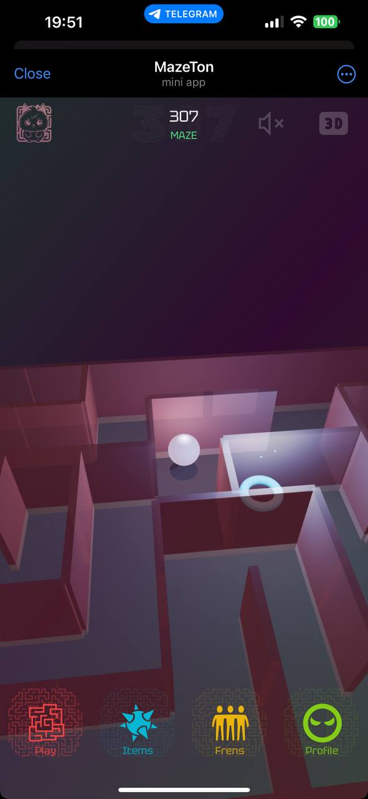

<!-- npx @marp-team/marp-cli@latest pitch.md -o index.html -->

# MazeTon 🌀 AI

## A Telegram Mini App AI-Generated Mazes Adventure

---

A 3D AI-generated maze adventure game within Telegram Mini App.

### Key Scenarios / Features:

- Dynamic Mazes: Tailored to player skill level.
- Social Challenges: Compete with friends.
- Item Collection & Superpowers: Enhance gameplay.
- Anti-Bot Mechanisms: Secure and fair play.

### Problems Solved:

- Repetitive puzzle boredom.
- Lack of social engagement in single-player games.
- Ensuring fair play through anti-cheat measures.

---

# Project Development

### Research Conducted:

- **Methods**: Beta Testing.
- **Participants**:
  - 10 beta testers (closed testing).

### Results:

- Users have asked to add a swipe inversion option.
- Increased engagement with social competition.

### Tools:

- Competitor Analysis.
- Three.js & Telegram API insights.

---

# The Team

### Why We Can Deliver:

- **Game Development**: Skilled in Three.js and React for 3D environments.
- **AI Experts**: Custom maze generation algorithms.
- **Telegram Integration**: Mastery of WebApp API.
- **Marketing & Community**: Experience in building gaming communities.

---

# Go-to-Market Strategy

### Goals:

- Build a loyal Telegram gaming community.

### Target Audience:

- **Casual Gamers**: 18-35 years, active on Telegram.
- **Behavior Patterns**: Quick, competitive games.
- **Habitats**: Telegram gaming channels and communities.

### Entry Points:

- Influencer partnerships.
- Viral referral campaigns.
- Community-driven events.

---

# Social & Viral Mechanics

### Key Features:

- **Leaderboards**: Competitive ranking.
- **Friend Challenges**: Beat friend’s scores.
- **Achievements & Badges**: Milestone rewards.
- **Referral Bonuses**: Earn rewards for inviting friends.
- **Shared Progress**: Social media sharing directly from Telegram.

---

# Competitor Analysis

| **Feature/Competitor**     | **Notcoin** | **Hamster** | **Blum** | **MazeTon** |
| -------------------------- | ----------- | ----------- | -------- | ----------- |
| **Dynamic Mazes**          | No          | No          | No       | Yes         |
| **Anti-Bot Protection**    | Yes         | Yes         | Yes      | Yes         |
| **Social Integration**     | Yes         | Yes         | Yes      | Yes         |
| **Store**                  | Yes         | Yes         | Yes      | Yes         |
| **TON Wallet Integration** | Yes         | Yes         | Yes      | Yes         |

---

# Target Audience

### Audience Description:

- **Primary Users**: Casual gamers, 18-35 years old.
- **Behavior Patterns**: Enjoy short, engaging, competitive games.

### Information Space & Habitats:

- Telegram gaming channels, chats, and communities.

### Entry Points:

- Telegram influencers.
- Gamified referral programs.
- Community tournaments and events.

---

# Tokenomics

- **In-Game Store**:  
  Sale of digital items and superpowers (e.g., Wall Jump, Teleport).

---

# Risks For The Project

| **Risk**                  | **Priority** | **Description**                              | **Mitigation Strategy**                                                                     |
| ------------------------- | ------------ | -------------------------------------------- | ------------------------------------------------------------------------------------------- |
| **Technical Issues**      | Middle       | Potential bugs or system failures            | AWS service can handle the loads                                                            |
| **User Adoption**         | Middle       | Difficulty in attracting and retaining users | Effective marketing and engagement strategies                                               |
| **Bots**                  | Middle       | Fast scoring by automatic systems            | Protection against bots is implemented on the server side in the form of automatic blocking |
| **Regulatory Compliance** | High         | Changes in laws affecting the service        | Stay updated on regulations, adapt as needed                                                |

---

### Immediate Next Steps:

- **Short-Term Features**:

  - Launch in-game store.
  - Integrate TON wallet for token withdrawals.

- **Mid-Term Features**:

  - Expand social mechanics (team challenges).
  - Introduce event-based mazes.

- **Long-Term Features**:
  - Seasonal content updates.
  - Potential platform expansion beyond Telegram.
